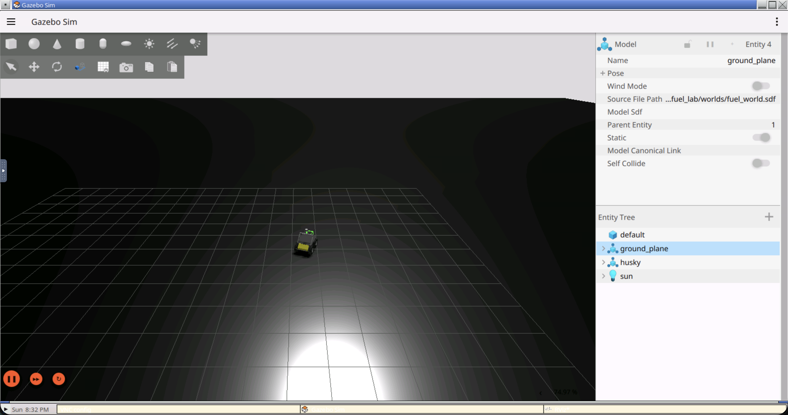
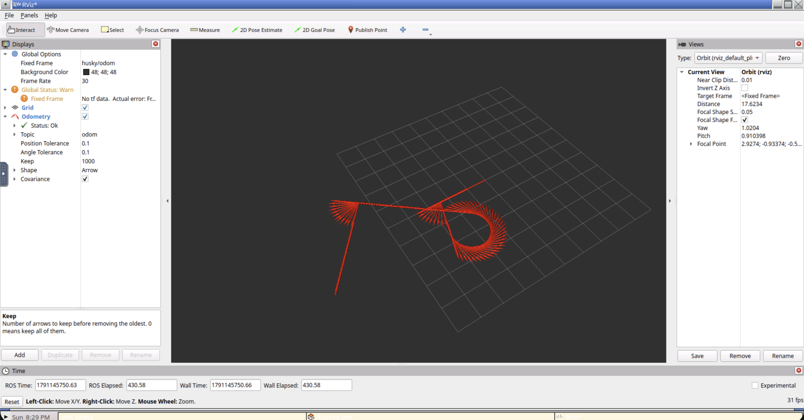
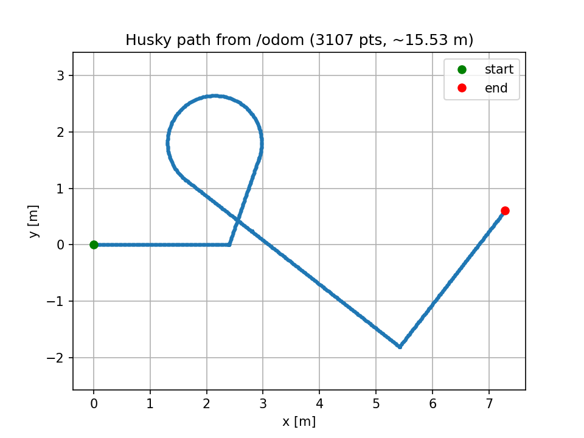

# Lab 1 — Driving an Off-the-Shelf Robot from ROS 2

Integration and control of the Clearpath Husky (`COSTAR_HUSKY_SENSOR_CONFIG_1`) model from Gazebo Fuel in ROS 2 Jazzy using Gazebo Harmonic.

---

## Run

### 1. Environment Setup (Dev Container)

1. Install the **Dev Containers** extension (`ms-vscode-remote.remote-containers`) in Visual Studio Code.
2. Open the `AIG` project folder in VS Code.
3. Press `F1` (or `Ctrl+Shift+P` / `Cmd+Shift+P`) and select:
   ```text
   Dev Containers: Reopen in Container
   ```
4. After the container loads, open a terminal and run the environment setup script (installs dependencies and builds the workspace):
   ```bash
   ./setup.sh
   ```

5. Open the graphical desktop (Fluxbox/VNC) in your browser:
   👉 **[http://localhost:6080/vnc.html](http://localhost:6080/vnc.html)** (port `6080`), click **Connect**.

---

### 2. Running the Experiment (in Separate Terminals)

To reproduce the full lab cycle, open **separate terminals** in VS Code:

#### Terminal 1: Gazebo Harmonic Simulator, ROS 2 Bridge and RViz
Launches the physics world with the Husky robot, the `parameter_bridge` node (`/cmd_vel` and `/odom`) and the RViz visualizer:
```bash
ros2 launch my_fuel_lab fuel.launch.py
```
*(In the browser at `localhost:6080` the Gazebo Sim window with the 3D robot model and RViz will appear).*

*RViz setup:*
- **Global Options $\rightarrow$ Fixed Frame:** set to `husky/odom`.
- Click **Add** $\rightarrow$ add an **Odometry** display (set **Topic** to `/odom` and change **Keep** to `1000`).

#### Terminal 2: Telemetry Node (odom_listener)
Prints position and velocity in real time:
```bash
ros2 run my_fuel_lab odom_listener
```

#### Terminal 3: 2D Trajectory Recording (plot_path.py)
The script records points from `/odom` and saves `path.png` on exit:
```bash
python3 src/my_fuel_lab/scripts/plot_path.py
```
*(After the drive finishes, press `Ctrl+C` in this terminal to save the plot).*

#### Terminal 4: Automated Mission Run and Measurements (measure_mission.py)
Replays the test route (straight $\rightarrow$ 90° turn $\rightarrow$ straight $\rightarrow$ loop $\rightarrow$ finish) and compares asked vs actual distance:
```bash
python3 src/my_fuel_lab/scripts/measure_mission.py
```

#### Terminal 5: Interactive Keyboard Teleoperation (optional)
Drive the robot manually with `teleop_twist_keyboard`:
```bash
ros2 run teleop_twist_keyboard teleop_twist_keyboard
```

*Keyboard layout (`teleop_twist_keyboard`, default speed $0.5\text{ m/s}$, turn $1.0\text{ rad/s}$):*

| Key | Action | Published `Twist` |
| :---: | :--- | :--- |
| **`i`** | Drive forward | `linear.x = +speed` |
| **`,`** | Drive backward | `linear.x = -speed` |
| **`j`** | Turn left on the spot | `angular.z = +turn` |
| **`l`** | Turn right on the spot | `angular.z = -turn` |
| **`u`** / **`o`** | Forward + turn left / right (arc) | `linear.x = +speed`, `angular.z = ±turn` |
| **`m`** / **`.`** | Backward + turn left / right (arc) | `linear.x = -speed`, `angular.z = ±turn` |
| **`k`** or any other key | **Full stop** | all zeros |
| **`q`** / **`z`** | Increase / decrease speed by 10% | scales `speed` and `turn` |
| **`Shift`** + movement key | Strafe sideways (holonomic robots only; Husky ignores it) | `linear.y` |

---

## See

### Gazebo Simulation (3D World)
The Husky robot driving the mission route in the Gazebo Harmonic physics world:



### RViz Odometry Trail (3D)
Visualisation of the driven trajectory via `nav_msgs/msg/Odometry` arrows in RViz:



### Odometry Path Plot (2D)
$X-Y$ trajectory recorded by `src/my_fuel_lab/scripts/plot_path.py` from the `/odom` topic during the `measure_mission.py` run (total path length $\approx 9.24\text{ m}$):



---

## Numbers

Actual execution data obtained by running `scripts/measure_mission.py` against the running simulation:

| Segment | Command (v, ω, t) | Asked Distance | Got Distance (`/odom`) | Difference |
| :--- | :--- | :---: | :---: | :---: |
| **Straight 1 (bottom)** | `v = 0.5 m/s`, `ω = 0.0 rad/s`, `6.0 s` | 3.00 m | 2.48 m | 0.52 m (17.3%) |
| **Turn Left 90°** | `v = 0.0 m/s`, `ω = 1.0 rad/s`, `1.57 s` | 0.00 m | 0.00 m | 0.00 m (0.0%) |
| **Straight 2** | `v = 0.5 m/s`, `ω = 0.0 rad/s`, `4.0 s` | 2.00 m | 1.55 m | 0.45 m (22.5%) |
| **Loop (curve)** | `v = 0.5 m/s`, `ω = 0.6 rad/s`, `10.0 s` | 5.00 m | 3.79 m | 1.21 m (24.2%) |
| **Straight 3 (final)** | `v = 0.5 m/s`, `ω = 0.0 rad/s`, `4.0 s` | 2.00 m | 1.42 m | 0.58 m (29.0%) |
| **TOTAL** | — | **12.00 m** | **9.24 m** | **2.76 m (23.0%)** |

#### Key Analytical Takeaways:
1. **Simulation Time vs Wall-Clock:** The constant ~17–23% discrepancy is primarily driven by the software-rendered container Real-Time Factor (RTF ≈ 0.78–0.82). In 6 seconds of real time, the physics engine advances only ≈ 4.8 seconds of simulation time.
2. **Skid-Steer Lateral Scrubbing:** The largest absolute error (1.21 m) occurred during the **Loop** maneuver because turning a 4WD rigid-wheel base requires lateral tire slipping/scrubbing against the ground plane, introducing significant drag and odometry drift.
3. **Pure In-Place Rotation:** The 90° turn on the spot yielded 0.00 m translational displacement, confirming symmetric wheel speed application by the `DiffDrive` plugin during pure angular commands.

---

## Compare

Driving from the command line (`ros2 topic pub`) provides precise, deterministic input parameters (exact velocity and fixed duration), making it ideal for quantitative benchmarking, testing straight-line odometry accuracy, and repeatable automated experiments. However, it lacks interactivity and requires explicit stop commands (`{}`) to prevent runaway motion due to controller velocity latching. In contrast, keyboard teleoperation (`teleop_twist_keyboard`) offers intuitive, real-time closed-loop control with immediate stop-on-release safety semantics, enabling complex maneuvers (such as loops and turns); however, human reaction delay and variable keypress durations make trajectories non-deterministic and unsuitable for repeatable distance calibration.
